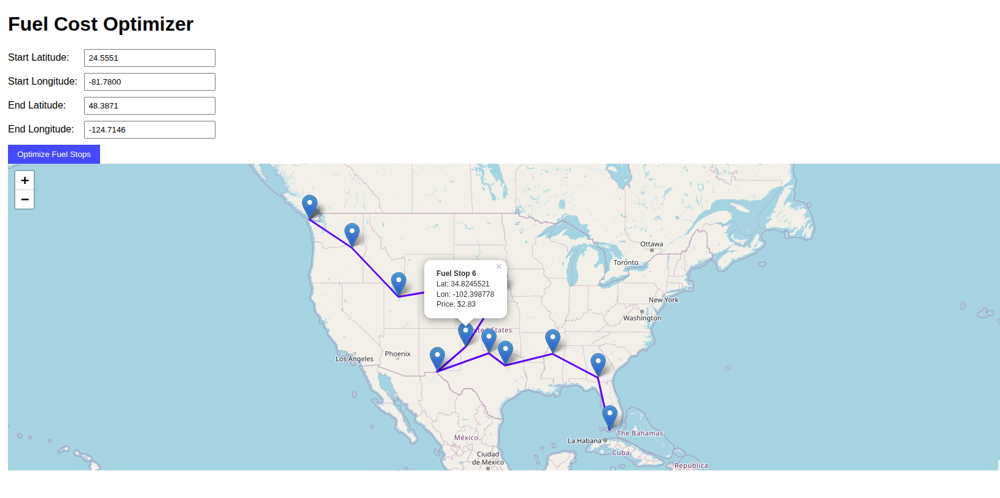

# Fuel Cost Optimizer API

[](https://www.python.org/downloads/release/python-312/)
[](https://www.djangoproject.com/)
[](https://python-poetry.org/)

## Description

This project provides a Django API for optimizing fuel costs along a route. It takes start and finish locations as input and returns a map of the route along with optimal locations to fuel up, considering fuel prices and a vehicle's range.

## Features

*   **Django API:** Exposes fuel optimization functionality through a REST API.
*   **Fuel Cost Optimization:** Calculates optimal fuel stops based on fuel prices and vehicle range.
*   **Route Calculation:** Calculates the route between start and finish locations using the GraphHopper API.
*   **JSON Response:** Returns optimal fuel stops and total fuel cost in JSON format.
*   **Dependency Management:** Uses Poetry for managing dependencies, including `aiohttp`, `aiofiles`, `requests`, `python-dotenv`, `scipy`, and `scikit-learn`.

## How it works?

The core logic for fuel cost optimization is implemented in `fuel_optimizer.py`. Here's a high-level overview of the process:

1.  **Route Calculation:** The `calculate_route` function uses the GraphHopper API to determine the geographical path between the specified start and finish coordinates.
2.  **Fuel Data Cleaning:** The `clean_fuel_data` function processes raw fuel price data, converting latitude, longitude, and retail prices to appropriate numerical formats and building a `BallTree` for efficient spatial querying of fuel stations.
3.  **Optimal Fuel Stop Determination:** The `determine_optimal_fuel_stops` function orchestrates the optimization. It iteratively identifies potential fuel stops along the calculated route, considering the vehicle's fuel range. It prioritizes stops that are within range and move the vehicle closer to the destination, aiming to find the most cost-effective fueling points. The algorithm ensures that the vehicle can always reach the next optimal stop or the final destination.
4.  **Output:** The function returns a list of optimal fuel stops with details like fuel added and cost, along with summary statistics including the total number of stops, total fuel cost, and total fuel added.

## Project Structure

```
.
├── README.md           # This file
├── fuel_app/           # Django project directory
│   ├── manage.py       # Django management script
│   ├── fuel_app/       # Django project settings
│   │   ├── __init__.py
│   │   ├── asgi.py
│   │   ├── settings.py # Django settings
│   │   ├── urls.py     # Django URL configuration
│   │   └── wsgi.py
│   ├── optimizer/      # Django app for fuel optimization
│   │   ├── __init__.py
│   │   ├── models.py   # Django models (if any)
│   │   ├── urls.py     # Django app URL configuration
│   │   ├── views.py    # Django views (API endpoints)
│   │   └── ...
├── fuel-prices-cleaned.csv # CSV file containing fuel prices
├── fuel_optimizer.py   # Core fuel optimization logic
├── pyproject.toml      # Poetry configuration and dependencies
├── poetry.lock         # Poetry lock file
└── fuel_app/templates/index.html # Frontend HTML for the web interface
```

## Setup

1.  **Clone the repository:**
    ```bash
    git clone <repository_url>
    cd fuel-cost-optimizer
    git checkout django-app
    ```

2.  **Install Poetry:** If you don't have Poetry installed, follow the instructions [here](https://python-poetry.org/docs/#installation).

3.  **Install Dependencies:**
    ```bash
    poetry install
    ```
    This command creates a virtual environment and installs all necessary dependencies specified in `pyproject.toml`.

4.  **Configure Environment Variables:**
    *   Create a `.env` file in the project root directory (where `pyproject.toml` is located).
    *   Add your GraphHopper API key to the `.env` file:
        ```dotenv
        # .env
        GRAPH_HOPPER_API_KEY=your_graphhopper_api_key_here
        ```
    *   Replace the placeholder value with your actual key.

5.  **Apply Migrations:**
    ```bash
    python fuel_app/manage.py migrate
    ```

## Running the API Locally

Activate the Poetry virtual environment and run the Django development server:

```bash
poetry shell
python fuel_app/manage.py runserver
```

The API will be accessible at `http://localhost:8000`.

## API Usage

### Endpoint: `/optimizer/optimal_fuel_stops/`

*   **Method:** `GET`
*   **Description:** Calculates optimal fuel stops for a given route.
*   **Query Parameters:**
    *   `start_latitude` (float, required): Latitude of the starting location.
    *   `start_longitude` (float, required): Longitude of the starting location.
    *   `finish_latitude` (float, required): Latitude of the destination location.
    *   `finish_longitude` (float, required): Longitude of the destination location.

*   **Example Request (using `curl`):**
    ```bash
    curl "http://localhost:8000/optimizer/optimal_fuel_stops/?start_latitude=24.5551&start_longitude=-81.7800&finish_latitude=48.3871&finish_longitude=-124.7146"
    ```

*   **Success Response:**
    *   **Status Code:** `200 OK`
    *   **Body (JSON):**
        ```json
        {
          "optimal_stops": [
            // List of optimal fuel stops
            {
              "Truckstop Name": "...",
              "Latitude": "...",
              "Longitude": "...",
              "Fuel Added (gallons)": "...",
              "Cost ($)": "..."
            },
            ...
          ],
          "start_lat": "...",
          "start_lon": "...",
          "finish_lat": "...",
          "finish_lon": "...",
          "Number Of Fuel Stops": "...",
          "Total Fuel Cost": "...",
          "Total Fuel Added": "..."
        }
        ```

*   **Error Responses:**
    *   `500 Internal Server Error`: If there's an issue during route calculation or data processing.

## Testing

To test the API, you can send a GET request to the `/optimizer/optimal_fuel_stops/` endpoint with valid query parameters. You can use tools like `curl` or Postman to send the request and inspect the response.

## Web Interface

This project includes a basic web interface for visualizing the optimal fuel stops on a map.

### Accessing the Web Interface

After running the Django development server (as described in "Running the API Locally"), open your web browser and navigate to:

```
http://localhost:8000/
```

### Functionality

*   Enter the start and finish latitude/longitude coordinates.
*   Click "Optimize Fuel Stops" to send a request to the API.
*   The route and optimal fuel stops will be displayed on an interactive map using Leaflet.js.
*   Popups on markers provide details about start, end, and fuel stop locations.


